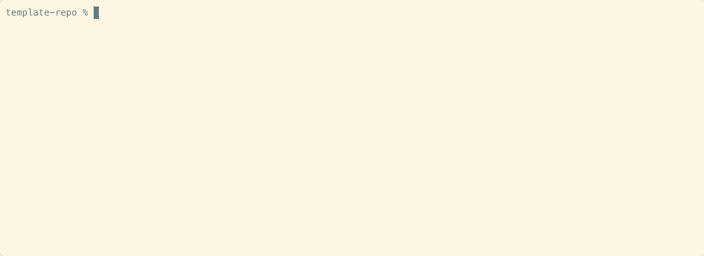

# Contributing to this project

This has started as a personal project, but I am doing it publicly on github
with the hope that it is helpful to some folks.  If you notice something that
could be better, please file an [issue](../../../issues).

## Other docs

Please review the [Contributor Covenant](CODE_OF_CONDUCT.md) to understand our
base expectations for participation.

There is a [Security Policy](SECURITY.md) for security-related issues.

## Reporting problems

Please file a [github issue](../../../issues) with a clear summary of your problem.
Output samples and exact error messages will help in debugging.

Please paste text into the bug report rather than taking a screen shot
unless a screen shot is the only way to convey your problem.

## Developer Certificate of Origin (DCO)

To ensure that all contributors are legally authorized to submit their
contributions, this project requires every commit to include a `Signed-off-by:`
trailer.  This applies to every commit, not just PR merge commits.

Use `git commit -s` to automatically append the trailer:

```bash
git commit -s -m "your commit message"
```

This asserts that you agree to the **Developer Certificate of Origin, version
1.1**:

> By making a contribution to this project, I certify that:
>
> 1. The contribution was created in whole or in part by me and I have the
>    right to submit it under the open source license indicated in the file; or
> 2. The contribution is based upon previous work that, to the best of my
>    knowledge, is covered under an appropriate open source license and I have
>    the right under that license to submit that work with modifications,
>    whether created in whole or in part by me, under the same open source
>    license (unless I am permitted to submit under a different license); or
> 3. The contribution was provided directly to me by some other person who
>    certified (1), (2) or (3) and I have not modified it.
> 4. I understand and agree that this project and the contribution are public
>    and that a record of the contribution (including all personal information
>    I submit with it) is maintained indefinitely and may be redistributed
>    consistent with this project or the open source license(s) involved.

Pull requests missing `Signed-off-by:` on any commit will be flagged by the
[DCO GitHub App](https://github.com/apps/dco) and cannot be merged until the
trailers are added.

To fix a missing trailer on the most recent commit:

```bash
git commit --amend -s
```

To fix multiple commits, use an interactive rebase with `git rebase -i` and
add `-s` to each pick line, or use `git filter-repo` for broader
history fixes.

## Contributing code

- Major changes should probably be discussed in an [issue](../../../issues) first.
- Fork the repo on github.
- Make a branch in your branch on your repo.
- Add commits with good commit messages (use `git commit -s` to include the DCO trailer).
- Open a pull request on github.
- Check the github actions on your PR to see if there's anything to fix.

## Development requirements

- `just`
- `gh` - github CLI
- `bash`

## Development process



The [justfile](../justfile) is used for centralizing snippets for build
and development purposes.

The full development cycle works via the command line.

1. Starting with a cloned repo, run `just branch $some-name`
1. Make some changes and make sure your last commit message conveys your
   overall purpose.
1. Run `just pr` and it will create a PR based on your last commit message.
1. Optionally, you can make other commits or update the PR description.
1. Finally, `just merge` will merge the PR with squashed commit history and
   cleaned up branches locally and remotely.  You'll end up with a repo back
   on `main` (release) branch with the latest `git pull`ed.

Run `just` anywhere in the repo to see which subcommands are available here.
You should get a more colorful version of this:

```bash
% just
just --list
Available recipes:
    [Claude Code]
    claude_permissions_check # Check Claude Code permissions structure
    claude_permissions_sort  # Sort Claude Code permissions in canonical order

    [Copilot]
    copilot_pick             # Interactive Copilot suggestion picker
    copilot_refresh          # Request a new Copilot review on current PR
    copilot_rollback         # Restore from Copilot backup

    [Process]
    again                    # push changes, update PR description, and watch GHAs
    branch branchname        # start a new branch
    claude_review            # Claude's latest PR code review
    merge                    # merge PR and return to starting point
    pr                       # PR create v5.4
    pr_checks                # watch GHAs then check for Copilot suggestions
    pr_update                # update the Done section of PR description with current commits
    pr_verify                # add or append to Verify section from stdin
    prweb                    # view PR in web browser
    release rel_version      # make a release
    release_age              # check how long ago the last release was
    sync                     # escape from branch, back to starting point

    [Template Maintenance]
    checksums_diff filepath  # Show diff between local and latest template version
    checksums_generate       # Generate versioned checksums from git history (template-repo only)
    cue-sync-from-github     # sync description and topics from GitHub API into .repo.toml
    update_from_template     # Update .just modules from template-repo (derived repos only)

    [Testing/Automation]
    checksums_verify         # Verify local .just files against template versions
    pr_body_test             # test PR body update logic
    repo_toml_check          # check if generated shell file is up-to-date
    repo_toml_generate       # generate shell variables from .repo.toml
    template_sync_test       # test template sync logic

    [Testing/Compliance]
    compliance_check         # our own repo compliance check
    cue-verify               # use Cue to verify /.repo.toml validity and flag configuration
    shellcheck               # run shellcheck on all bash scripts in just recipes

    [Utility]
    clean_template           # clean debris out of template
    list                     # list recipes (default works without naming it)
    utcdate                  # print UTC date in ISO format
Your justfile is waiting for more scripts and snippets
```
