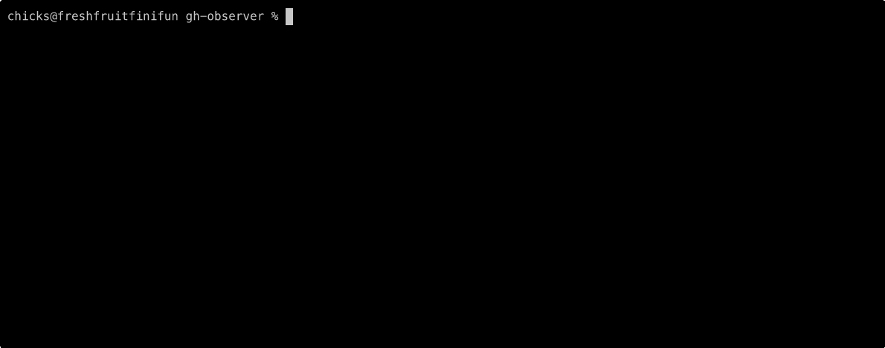

# gh-observer


A GitHub PR check watcher that improves on `gh pr checks --watch` by showing
runtime metrics, queue latency, and better handling of startup delays.


## Why?

The existing `gh pr checks --watch` doesn't show how long checks have been running, doesn't handle the 30-90s startup delay well, and doesn't show queue latency. This creates anxiety when watching CI runs - "is it stuck or just slow?"

## Features

- **Real-time status updates** - Poll GitHub API every 5s (configurable)
- **Runtime metrics** - Shows elapsed time for running checks
- **Queue latency** - Displays how long checks waited before starting
- **Startup phase handling** - Helpful messages during GitHub Actions startup delay
- **Rate limit awareness** - Backs off automatically if approaching limits
- **Exit codes** - Returns 0 for success, 1 for any failures

## Installation

### Install precompiled binary

The easiest way to install gh-observer is as a GitHub CLI extension:

```bash
gh extension install fini-net/gh-observer
```

This installs a precompiled binary for your platform - no Go toolchain required. To install a specific version:

```bash
gh extension install fini-net/gh-observer --pin v1.0.0
```

### Or install via go install

If you prefer installing via Go:

```bash
go install github.com/fini-net/gh-observer@latest
```

### Or build from source

To build from source:

```bash
git clone https://github.com/fini-net/gh-observer.git
cd gh-observer
just build
```

## Usage

### Auto-detect PR from current branch

```bash
gh-observer
```

### Watch specific PR

```bash
gh-observer 123
```

### Use in CI pipelines

```bash
# Wait for checks to complete and exit with their status
gh-observer && echo "All checks passed!"
```

## Configuration

Create `~/.config/gh-observer/config.yaml` to customize settings:

```yaml
# Refresh interval for polling GitHub API
refresh_interval: 5s

# Color codes for terminal output (ANSI 256-color palette)
colors:
  success: 10  # Green - completed successfully
  failure: 9   # Red - completed with failure
  running: 11  # Yellow - currently in progress
  queued: 8    # Gray - waiting to start
```

See `.config.example.yaml` for reference.

## Authentication

gh-observer uses GitHub authentication in this order:

1. `GITHUB_TOKEN` environment variable
2. `gh` CLI authentication (`gh auth token`)

Make sure you have either set up.

## Supported Platforms

Precompiled binaries are available for:

- **macOS**: Intel (amd64) and Apple Silicon (arm64)
- **Linux**: x86-64 (amd64) and ARM64
- **Windows**: x86-64 (amd64)

All binaries include supply chain security attestations for verification.

## Example Output

```ShellOuptut
PR #123: Add new feature

Startup Phase (37s elapsed):
  ⏳ Waiting for Actions to start...
  💡 GitHub typically takes 30-90s to queue jobs after PR creation

PR #5: 🔶 [claude] /init 21:04:15 UTC
Updated 0s ago  •  Pushed 43h 8m 11s ago

Startup   Workflow/Job                                Duration

  15s ✗ MarkdownLint / lint                             5s
   .github:13 - Failed with exit code: 1
   CLAUDE.md:100 - Lists should be surrounded by blank lines: CLAUDE.md:100 MD032/blanks-around-lists Lists should be surr

  15s ✓ Auto Assign / run                               5s
  15s ✓ CUE Validation / verify                         6s
  15s ✓ Checkov / scan                                 27s
  15s ✓ Claude Code Review / claude-review          3m 52s
  15s ✓ Lint GitHub Actions workflows / actionlint      8s
  39s ✓ Checkov                                         2s

Press q to quit
```

## Example Animations

Thanks to [asciinema](https://asciinema.org/) we can show you:

### PR that was already merged


### PR that was just created



This was sped up 2x for your viewing pleasure.

The Claude failure was expected - I was out of my weekly quota.  But it also shows
how the error log output is attractively integrated in with the list of jobs.

## Development

This project uses [just](https://github.com/casey/just) for task automation:

```bash
# Build the binary
just build

# Run on current PR
./gh-observer

# Create a PR
just pr

# Merge a PR
just merge
```

## Architecture

Built with:

- [Bubbletea](https://github.com/charmbracelet/bubbletea) - TUI framework
- [Lipgloss](https://github.com/charmbracelet/lipgloss) - Terminal styling
- [go-github](https://github.com/google/go-github) - GitHub API client
- [Viper](https://github.com/spf13/viper) - Configuration management

See `CLAUDE.md` for detailed implementation notes.

## Contributing

- [Code of Conduct](.github/CODE_OF_CONDUCT.md)
- [Contributing Guide](.github/CONTRIBUTING.md) includes a step-by-step guide to our
  [development process](.github/CONTRIBUTING.md#development-process).

## Support & Security

- [Getting Support](.github/SUPPORT.md)
- [Security Policy](.github/SECURITY.md)
