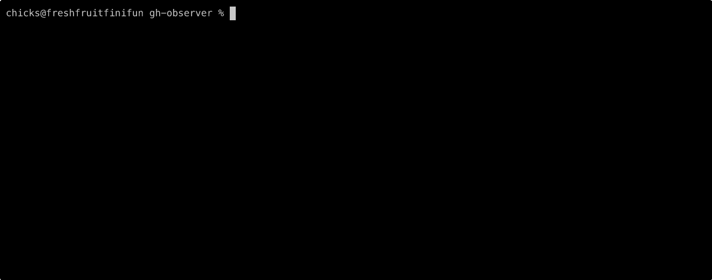
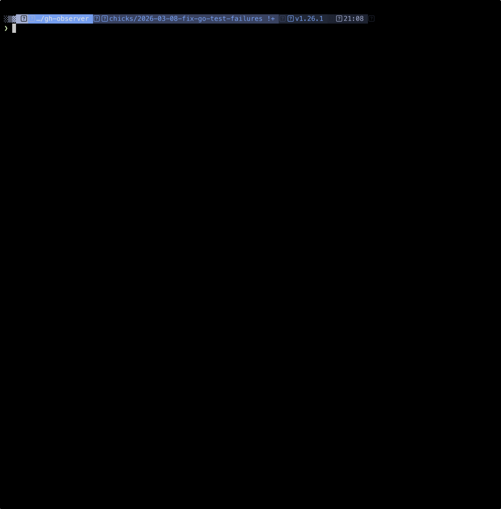

# Animations for prior versions

If you'd like to see the evolution of this github extension, here are some
early examples of how it looked.

## Acknowledgements

Thanks to [asciinema](https://asciinema.org/) for making this so easy for
so many years!  Thank you.

## v0.3 - February 2026

### PR that was already merged

This show in real-time (not accelerated) how it goes when you check out a
PR that is already merged.

### PR that was just created

This was sped up 2x.  In this example, the Claude check fails, illustrating how
error log output is integrated alongside the list of jobs.

## v0.9 - March 2026

### PR that was just created with GHAs that use descriptions

The [Super-Linter](https://github.com/super-linter/super-linter) and a few other
GitHub Actions utilize the description field to convey success or failure.  Our
extension doesn't show descriptions for successful checks and displays them for
cases with errors to be consistent with the GitHub Actions that make it easier
to show the right bit of the logs.  Since we don't try to show the logs for
super-linter, you're "stuck" clicking on the title of the job in your terminal
and it will open up in your favorite web browser.

This was sped up 10x.
